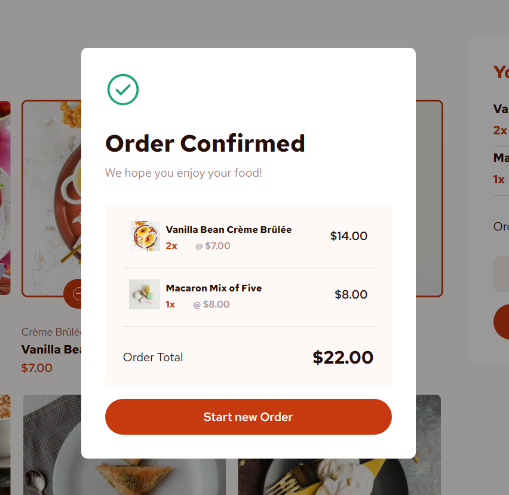
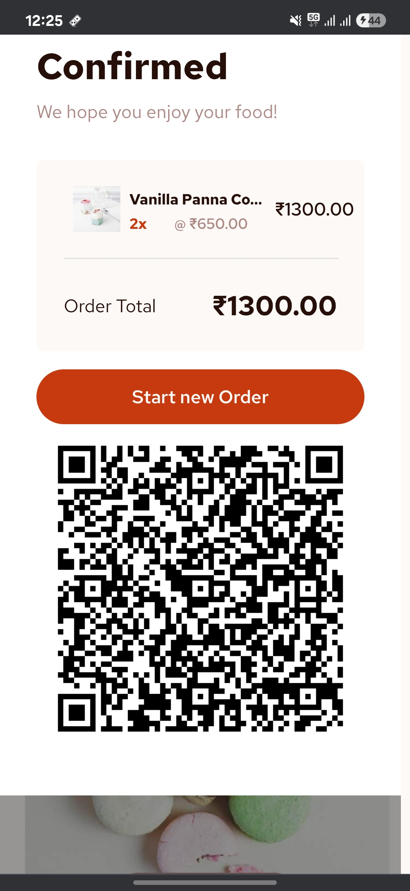

# Smart Medicine Vending Machine  

The **Smart Medicine Vending Machine** is an end-to-end system that automates the process of purchasing medicines. It integrates a **web-based software platform**, **machine learning models for medicine recognition**, and **secure UPI-based payments**. The system generates a **QR code for each transaction**, validates payment, and dispenses medicines automatically.  

---

## 🚀 Features  

- **User-friendly interface**: Browse and search for medicines easily.  
- **Cart system**: Add/remove medicines before checkout.  
- **QR Code Generation**: Unique QR codes generated for each bill.  
- **Secure Payment**: UPI integration for quick and reliable payments.  
- **Server-Side Validation**: QR scanned and verified on the backend before dispensing.  
- **Data Storage**: Bill text and QR image stored securely on the server.  
- **Machine Learning Integration**: Medicine recognition using computer vision (future scope).  

---

## 🛠️ Tech Stack  

- **Frontend**: HTML, CSS, JavaScript (with modern UI components).  
- **Backend**: Flask (Python) for server-side logic.  
- **Database**: SQLite / MySQL for user data, billing, and transaction history.  
- **Machine Learning**: TensorFlow / PyTorch (for medicine recognition).  
- **Payment Gateway**: UPI integration.  
- **QR Code**: Python `qrcode` library for generation.  

---

## ⚙️ How It Works  

1. **User logs in** → Access the vending system.  
2. **Medicine Selection** → User selects medicines, adds to cart.  
3. **Bill Generation** → System generates bill text + QR code.  
4. **Payment** → User pays via UPI using QR.  
5. **Verification** → Server validates payment & confirms transaction.  
6. **Dispensing** → Machine dispenses medicines automatically.  

---

## 📂 Project Structure  

```
SmartMedicineVending/
│── flask_app.py          # Main Flask backend
│── static/               # CSS, JS, images
│── templates/            # HTML pages
│── models/               # ML models for recognition
│── database/             # User & billing DB
│── qr_codes/             # Stored QR images
│── bills/                # Stored bill text files
│── requirements.txt      # Dependencies
│── README.md             # Project documentation
```

---

## 🔧 Installation  

1. Clone the repo:  
   ```bash
   git clone https://github.com/your-username/SmartMedicineVending.git
   cd SmartMedicineVending
   ```

2. Create and activate virtual environment:  
   ```bash
   python -m venv venv
   source venv/bin/activate   # Linux/Mac
   venv\Scripts\activate      # Windows
   ```

3. Install dependencies:  
   ```bash
   pip install -r requirements.txt
   ```

4. Run the server:  
   ```bash
   python flask_app.py
   ```

5. Open in browser:  
   ```
   http://127.0.0.1:5000
   ```

---

## 📸 Screenshots

 
 
 
---

## 📌 Future Enhancements  

- Add AI-based prescription scanning.  
- Integrate multilingual support for rural areas.  
- Enable remote health monitoring + suggestions.  
- Expand payment methods (Cards, Wallets).  

---

## 👨‍💻 Contributors  

- **Ayush Bhowmick** – Developer & ML Integration  
